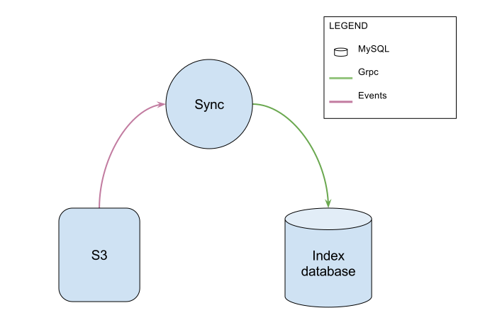
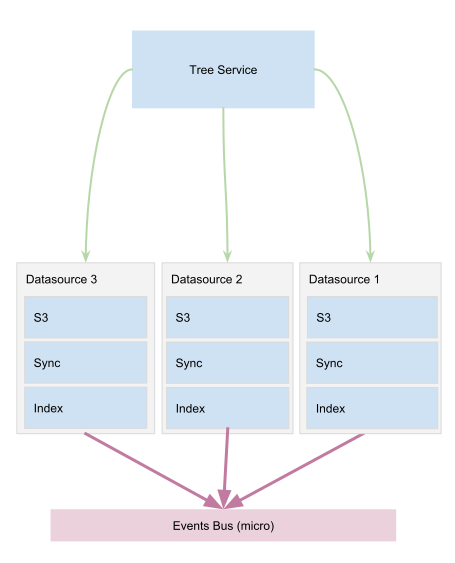

Datasources and indexation
==========================
A Datasource provides access to data. It continuously listens and stores changes to maintain a consistent data index.

What is a datasource?
*********************

Internally, a datasource is composed of (see the image above):

- **A storage service** : Provides access to the data and can be accessed by any tool that talks Amazon S3 protocol.

- **An index service** : Stores the data state and stands as the only source of truth for request on data state.

- **A synchronizer** : Maintains the storage and the index database synchronized.

Every time a datasource has its state updated, the index service publishes events to notify the other services.

.. image:: ../img/pydio-data.svg
    :target: ../images/pydio-data.svg
    :alt: datasource in Pydio environment

The index is currently stored in 3 tables in the database. As other micro-services, it can be configured to use its own
database, allowing to easily shard data across multiple nodes.

The tree service
****************
The tree service aggregates all the datasources and presents the whole as a single data tree in which each datasource is a child of the root node.

This master tree is used internally to identify nodes by their UUID. It is used globally inside the application, and the ACL (Access Control List) are just flags positioned on any node UUID to grant read/write access to a user to a given node. This is how workspaces and shares are implemented. See the next chapter to learn more about Identity Management.