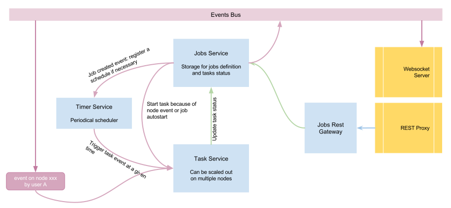

Scheduler Jobs
==============

Services involved
*****************

Pydio comes with a powerful built-in scheduler that is composed of three different services:

 - **jobs** : The jobs service is the main interface with the scheduler. It is in charge of persisting the jobs definition and the tasks statuses, and send proper events when they change.
 - **timer**: Timer service is a simple scheduler that will analyze jobs definition and send task trigger events at a given time if necessary
 - **tasks**: The tasks runners are stateless, pool-based workers that will react to timer events, node events or job changes events to actually run the tasks.

The figure below shows how these three services interact.

Jobs are currently stored inside a BoltDB file, which implies that the jobs service cannot be scaled for the moment, but the tasks runner themselves can be easily dispatched on many servers, as they listen to events in a queued manner (only one node with read an event).

Jobs and Actions
****************

Jobs are defined by unitary Actions, that can be started in parallel or in a chained way. Actions are small pieces of code that are already compiled in the binary. Each step can take an input, define how to eventually filter this output, and send data to the output.

Below is a diagram of how actions are processed when actually running a task.

Preset Jobs
***********

Pydio internally uses the scheduler to perform the following tasks

 - Automatically extract Thumbnails and EXIF data from images whenever they are created/modified.
 - Create versions of any files whenever they change

Pydio Client is able to send a PutJob request to the scheduler to trigger a specific action "sync-users", which will synchronize an external directory (currently LDAP) with the internal API. See 'client job sync-users'.