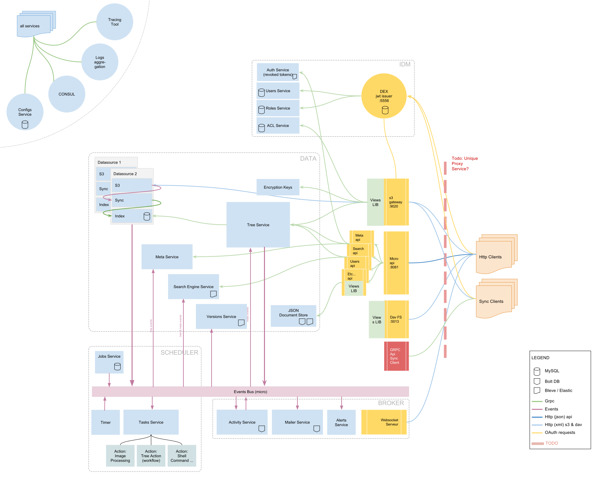

Introduction
============

Overview
********

This tech preview is released in order to start detecting deployment issues on heterogenous systems. It is provided as is,
please note that Pydio9 is currently **NOT READY** for production. Use it at your own risks!

Distribution comes in the form of precompiled binaires for Linux and Mac OSX. Windows will come later in the process, but
will definitely be supported in the final release. A specific PHP front-end is also packaged and distributed, with an installation
process very similar to the current stable version of Pydio (8.0.1).

What's new in Pydio 9
*********************

Pydio 9 is a full rewrite of Pydio backend using **Go**, a modern server language developed and used by Google. Although still relying on PHP for the frontend part, most of the core features are now running in micro-service architecture. Micro-services are small pieces of software that can run independantly, scale-out easily by running on a distributed infrastructure, and they communicate using GRPC.

Below is an overview of this new architecture (click on it to see the detail) :

Currently, application data storage is persisted either in a database (MySQL only for the moment) or in an embedded KVStore (BoltDB) depending on the service. This will be unified further in the development.

APIs exposed to the world are following the "API Gateway" pattern : each GRPC service may provide an additional gateway service that translates HTTP Rest into GRPC. Finally, a dedicated service is acting as a proxy to dispatch incoming queries to these gateways. PHP is no more talking to a MySQL database but directly to this top-level proxy.

Along with the REST Api's explained above, data is exposed via a set of standard protocols:

- Authentication is following the OpenIDConnect Protocol, a layer developed on top of OAuth2, using JWT.
- Files can be managed using the Amazon S3 protocol.
- Activities are published in the Activity Streams 2.0 format (by w3c).
- Logs are redirect to the stdout in JSON format, to be aggregated in ELK or similar.

The road is not finished yet, but the work done is already huge and pretty exciting!

Requirements
************

Backend
.......

The following is required to install and run the pydio9 micro services:

- Linux 64bit or MacOS 64bit
- MySQL/MariaDB **v5.6+** (there is currently a known issue with v5.5 and below)

FrontEnd
........

Similar to Pydio8.0.1, but with less php extensions needed :

- Php-enabled web server (Apache / Nginx) supporting url rewrites
- Php v5.6 or v7.X
- Php Extensions : CURL, GD